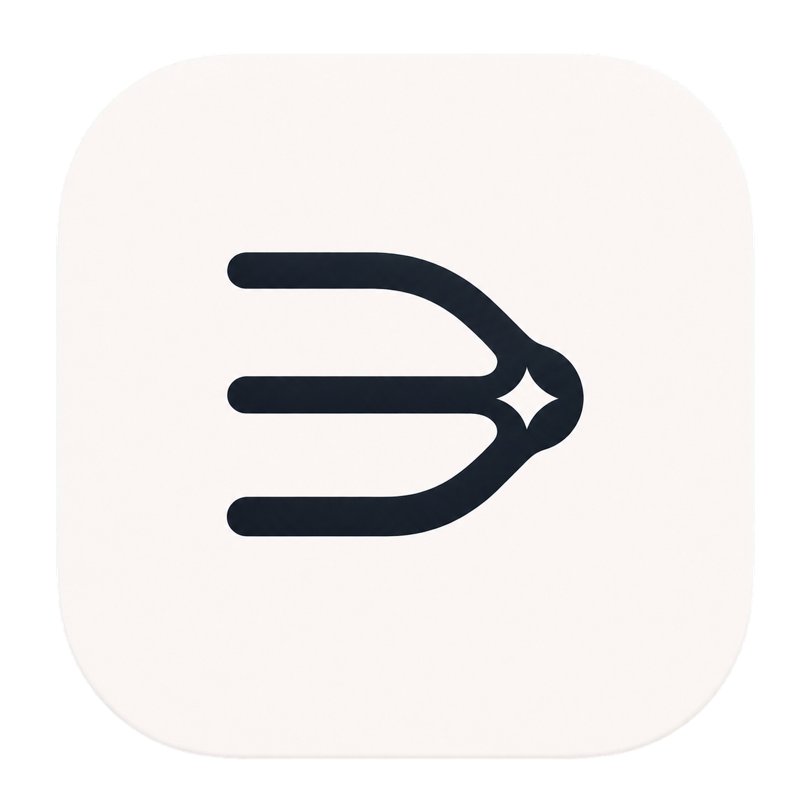
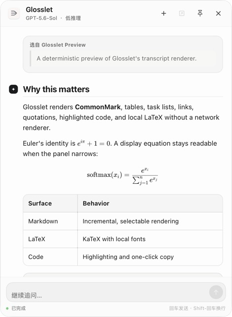

<p align="center">
  
</p>

<h1 align="center">Glosslet</h1>

<p align="center">
  Select text anywhere on your Mac. Explain it with Codex, right there.
</p>

<p align="center">
  <a href="LICENSE">MIT License</a> ·
  <a href="docs/PRIVACY.md">Privacy</a> ·
  <a href="docs/ARCHITECTURE.md">Architecture</a> ·
  <a href="THIRD_PARTY_NOTICES.md">Third-party notices</a>
</p>

Glosslet is a native macOS menu bar app that adds a tiny **Explain · Copy**
toolbar beside text selections. Explain opens a compact floating Codex
conversation with streaming answers and follow-up questions.

<p align="center">
  
</p>

Most importantly, Glosslet conversations are normal, persistent Codex tasks.
They appear in the Codex app, retain their history, and can be continued from
either place. Glosslet never uses hidden or ephemeral threads.

> [!NOTE]
> Glosslet is an unofficial open-source companion for Codex and is not
> affiliated with OpenAI.

## Highlights

- Works across native apps, browsers, editors, and other macOS interfaces that
  expose selected text through Accessibility.
- The selection toolbar contains exactly two actions: **Explain** and **Copy**.
- Streams Codex responses into a polished, resizable floating conversation.
- Renders headings, lists, task lists, tables, quotations, links, highlighted
  code, inline math, and display LaTeX using a fully local renderer.
- Starts unpinned and disappears when focus moves elsewhere; pin it when the
  conversation should remain above other apps.
- Supports follow-ups, stopping a turn, approvals, and opening the exact task
  in the Codex app.
- Reloads persistent history before every continuation, so turns added in the
  Codex app are present when the conversation continues in Glosslet.
- Reuses one fixed Codex task by default, or creates a new task for every
  explanation.
- Dynamically selects Codex's latest default model at its lowest advertised
  reasoning effort. You can instead inherit Codex defaults or choose a model
  and effort manually.
- Uses the installed Codex app server, sign-in, configuration, skills, MCP
  connections, sandbox, and approval policy.
- Keeps **Copy** entirely local. Selected text is sent only after you click
  **Explain**.

## Requirements

- macOS 14 or later
- Apple silicon or Intel Mac
- Codex installed and signed in (the Codex desktop app or Codex CLI)
- Accessibility permission for reading the current text selection and
  positioning the toolbar

Password fields and other secure controls are intentionally ignored. Apps that
render text without exposing a macOS Accessibility selection may not be
detectable.

Remote Markdown images are shown as links instead of loading automatically.
This keeps transcript rendering local and prevents an answer from silently
contacting a third-party image host.

## Build and run

```bash
git clone https://github.com/WineChord/glosslet.git
cd glosslet
scripts/build_app.sh release
open dist/Glosslet.app
```

The local build is ad-hoc signed. On first launch, use Glosslet's onboarding to
open **System Settings → Privacy & Security → Accessibility**, then enable
Glosslet. Rebuilding changes an ad-hoc signature, so macOS may require local
developers to remove and grant that permission again.

Run the full local validation:

```bash
scripts/check.sh
```

The live Codex integration tests are opt-in because they create a real,
persistent Codex task:

```bash
GLOSSLET_RUN_CODEX_INTEGRATION=1 \
  swift test --filter CodexAppServerIntegrationTests
```

## How persistence works

Glosslet launches `codex app-server` from the user's existing Codex
installation. It creates threads with `ephemeral: false`, gives them recognizable
`Glosslet — …` titles, and stores the fixed task identifier locally for reuse.
Before reuse, Glosslet restarts its app-server connection and reloads the
persistent history, including turns added from the Codex app. The floating
panel's **Open Codex** button deep-links to that exact task.

No API key is stored by Glosslet, and no separate chat database is created.
See [Architecture](docs/ARCHITECTURE.md) for the protocol flow.

## 中文

Glosslet 是一款原生 macOS 菜单栏工具。在几乎任何支持 macOS 辅助功能选区的
应用里划词、划句或划段落，旁边就会出现只有“解释”和“复制”两个按钮的工具条。

点击“解释”后，Glosslet 会在悬浮小窗里流式显示 Codex 回复，并支持直接追问。
所有会话都是可持久化的原生 Codex 任务：你可以在自己的 Codex App 中找到它们，
查看完整历史，并从任意一侧继续对话。

悬浮小窗支持 Markdown、表格、代码高亮与 LaTeX。默认不固定，点击其他地方就会
自动隐藏；需要边工作边查看时，可以点击标题栏中的固定按钮。

默认配置会动态选择 Codex 当前最新的默认模型，并使用该模型支持的最低推理程度；
也可以改为完全沿用 Codex 默认值，或手动选择模型与推理程度。

## Contributing

Issues and pull requests are welcome. Please read
[CONTRIBUTING.md](CONTRIBUTING.md) and [SECURITY.md](SECURITY.md) first.
