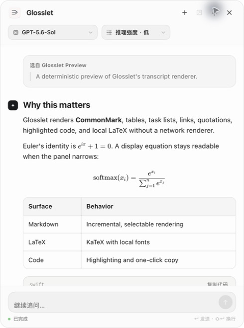

<p align="center">
  
</p>

<h1 align="center">Glosslet</h1>

<p align="center">
  Select text anywhere on your Mac. Explain it with Codex, right there.
</p>

<p align="center">
  <a href="LICENSE">MIT License</a> ·
  <a href="docs/PRIVACY.md">Privacy</a> ·
  <a href="docs/ARCHITECTURE.md">Architecture</a> ·
  <a href="THIRD_PARTY_NOTICES.md">Third-party notices</a>
</p>

Glosslet is a native macOS menu bar app that adds a tiny **Explain · Copy**
toolbar beside text selections. Explain opens a compact floating Codex
conversation with streaming answers and follow-up questions.

<p align="center">
  
</p>

Most importantly, Glosslet conversations are normal, persistent Codex tasks.
They appear in the Codex app, retain their history, and can be continued from
either place. Glosslet never uses hidden or ephemeral threads.

> [!NOTE]
> Glosslet is an unofficial open-source companion for Codex and is not
> affiliated with OpenAI.

## Highlights

- Works across native apps, browsers, editors, and other macOS interfaces that
  expose selected text through Accessibility.
- The selection toolbar contains exactly two actions: **Explain** and **Copy**.
- Places that toolbar at the selection endpoint instead of the center of a
  long or multiline selection, then keeps it fixed until the selection changes.
- Streams Codex responses into a polished, resizable floating conversation.
- Renders headings, lists, task lists, tables, quotations, links, highlighted
  code, inline math, and display LaTeX using a fully local renderer.
- Starts unpinned and disappears when focus moves elsewhere; pin it when the
  conversation should remain above other apps.
- Supports follow-ups, stopping a turn, approvals, and opening the exact task
  in the Codex app.
- Restores the fixed task and prewarms Codex skills, hooks, and MCP metadata
  when Glosslet launches, then keeps that task attached for fast consecutive
  explanations.
- Leaves context-window management, automatic compaction, and rollover to
  Codex. Glosslet reuses the persistent task without imposing its own token
  threshold or starting background maintenance turns.
- Distinguishes connection, task refresh, model thinking, and response writing,
  with live elapsed time instead of an indefinite generic spinner.
- Reuses one fixed Codex task by default, or creates a new task for every
  explanation.
- Dynamically selects Codex's latest default model at its lowest advertised
  reasoning effort and uses its priority service tier when the model advertises
  one. Priority processing is faster but consumes more Codex usage. Model and
  reasoning controls are available directly in the floating conversation; you
  can also choose Codex defaults.
- Uses the installed Codex app server, sign-in, configuration, skills, MCP
  connections, sandbox, and approval policy.
- Keeps **Copy** entirely local. Selected text is sent only after you click
  **Explain**.

## Requirements

- macOS 14 or later
- Apple silicon or Intel Mac
- Codex installed and signed in (the Codex desktop app or Codex CLI)
- Accessibility permission for reading the current text selection and
  positioning the toolbar

Password fields and other secure controls are intentionally ignored. Apps that
render text without exposing a macOS Accessibility selection may not be
detectable.

Remote Markdown images are shown as links instead of loading automatically.
This keeps transcript rendering local and prevents an answer from silently
contacting a third-party image host.

## Build and run

```bash
git clone https://github.com/WineChord/glosslet.git
cd glosslet
scripts/build_app.sh release
open dist/Glosslet.app
```

The default local build is ad-hoc signed. On first launch, use Glosslet's onboarding to
open **System Settings → Privacy & Security → Accessibility**, then enable
Glosslet. Rebuilding changes an ad-hoc signature, so macOS may require local
developers to grant that permission again. System Settings can leave the old
entry looking enabled even though it no longer matches the rebuilt app. Turn
Glosslet off and on; if it is still not recognized, remove the old entry and
add the current `dist/Glosslet.app`.

Release maintainers can provide a stable Apple code identity and optional
notarization profile:

```bash
GLOSSLET_CODESIGN_IDENTITY="Developer ID Application: Example (TEAMID)" \
GLOSSLET_NOTARY_PROFILE="glosslet-notary" \
scripts/package_release.sh
```

A Developer ID-signed update keeps a stable designated requirement, so macOS
can normally preserve Accessibility authorization across versions installed at
the same path. The public package remains ad-hoc signed until the project has
that certificate and notarization credential.

Run the full local validation:

```bash
scripts/check.sh
```

The live Codex integration tests are opt-in because they create a real,
persistent Codex task:

```bash
GLOSSLET_RUN_CODEX_INTEGRATION=1 \
  swift test --filter CodexAppServerIntegrationTests
```

## How persistence works

Glosslet launches `codex app-server` from the user's existing Codex
installation. It creates threads with `ephemeral: false`, gives them recognizable
`Glosslet — …` titles, and stores the fixed task identifier locally for reuse.
Consecutive Glosslet turns reuse the live task without another process restart.
When the Codex app is opened, Glosslet marks the task for a disk refresh before
the next turn so independently added history is restored. The floating panel's
**Open Codex** button deep-links to that exact task.

No API key is stored by Glosslet, and no separate chat database is created.
See [Architecture](docs/ARCHITECTURE.md) for the protocol flow.

## 中文

Glosslet 是一款原生 macOS 菜单栏工具。在几乎任何支持 macOS 辅助功能选区的
应用里划词、划句或划段落，旁边就会出现只有“解释”和“复制”两个按钮的工具条。
工具条会跟随划词结束时的鼠标或插入光标，不再停在整段选区的中心或屏幕角落。
工具条出现后会固定在该选区旁边，只有重新选择文本时才会移动。

点击“解释”后，Glosslet 会在悬浮小窗里流式显示 Codex 回复，并支持直接追问。
所有会话都是可持久化的原生 Codex 任务：你可以在自己的 Codex App 中找到它们，
查看完整历史，并从任意一侧继续对话。

悬浮小窗支持 Markdown、表格、代码高亮与 LaTeX。默认不固定，点击其他地方就会
自动隐藏；需要边工作边查看时，可以点击标题栏中的固定按钮。

默认配置会动态选择 Codex 当前最新的默认模型，并使用该模型支持的最低推理程度；
如果模型目录提供优先服务层，还会默认启用“极速”处理。极速处理更快，但会增加
Codex 额度消耗。悬浮窗顶部可以直接切换模型与推理强度，也可以改为完全沿用
Codex 默认值。Glosslet 启动时会在后台恢复固定任务并预热 Codex 运行环境；固定
任务上下文变长后，则使用 Codex 原生压缩保持后续响应速度，任务 ID 和可见历史
不会因此丢失。原生压缩本身也是一次 Codex 模型操作，会消耗相应额度。

本地重新构建会改变临时签名。如果系统设置中的 Glosslet 开关看似已开启，但应用
仍未识别，请先关闭再重新开启；如果仍无效，请移除旧条目后重新添加当前的
`dist/Glosslet.app`。使用固定的 Developer ID 签名并在同一路径覆盖安装后，macOS
通常可以在版本升级时继续沿用原有辅助功能授权；公开包目前仍是临时签名。

## Contributing

Issues and pull requests are welcome. Please read
[CONTRIBUTING.md](CONTRIBUTING.md) and [SECURITY.md](SECURITY.md) first.
