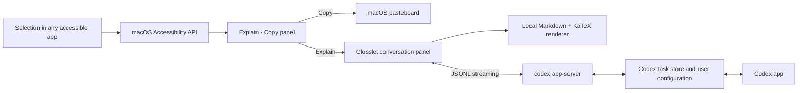

# Architecture

Glosslet is a native macOS accessory app built with AppKit and SwiftUI.



## Selection

`SelectionMonitor` observes global mouse-up and selection-related keyboard
events. `AccessibilitySelectionReader` asks the focused accessibility element
for `AXSelectedText`, its selected range, and the range bounds. Secure text
fields and Glosslet's own process are ignored.

The Accessibility coordinate system is converted per display before the panel
is positioned. Both panels are available across Spaces and full-screen apps.

## Conversation surface

The conversation shell is native AppKit and SwiftUI. Its transcript is a local
`WKWebView` with a non-persistent website data store and a restrictive Content
Security Policy. Bundled copies of markdown-it, highlight.js, and KaTeX render
Markdown, code, tables, and mathematics without a CDN or runtime network
dependency. Raw HTML is disabled.

Only the currently changing message is replaced during streaming. Existing
messages remain in the DOM, and automatic scrolling pauses when the reader
scrolls away from the bottom. Code-copy actions cross a narrow WebKit message
bridge to the macOS pasteboard. External links open only after a click. Remote
Markdown images are represented as links instead of being fetched
automatically.

The panel starts unpinned. A global outside-click monitor and app-activation
observer hide it when focus moves elsewhere, while the Codex turn continues in
the background. Pinning disables those dismissal observers and keeps the panel
above other apps until it is unpinned or closed.

## Codex transport

`CodexAppServerClient` launches the Codex executable already installed for the
current user:

1. Codex standalone installation
2. `~/.local/bin/codex`
3. `PATH`
4. Codex desktop resources
5. Homebrew locations

`GLOSSLET_CODEX_PATH` can override discovery for development.

The client performs the app-server initialization handshake and exchanges
newline-delimited JSON-RPC messages over standard input and output. Responses,
notifications, streamed agent-message deltas, turn lifecycle events, and
approval requests are decoded into typed Swift values.

## Persistent task invariant

Every new task uses `thread/start` with `ephemeral: false`. Glosslet never calls
thread deletion or archival APIs. The default mode stores one task ID in
`UserDefaults` and resumes it for later explanations. Per-explanation mode
starts a separate persistent task each time.

Tasks use the same Codex home and authentication as the user's Codex app, so
the Codex app can discover and continue them. The reverse direction works too:
before reusing a task or sending a follow-up, Glosslet restarts its app-server
connection and reloads the persistent task from disk. This avoids relying on a
stale in-process history when the Codex app added turns independently.

## Model policy

The app calls `model/list` instead of hard-coding a version. The default policy:

1. Ignore hidden and review-only entries.
2. Prefer the visible model marked as the current Codex default.
3. Select the lowest reasoning effort advertised by that model.

Users may instead omit both overrides to inherit Codex defaults, or select a
specific visible model and supported effort.

## Storage

Glosslet stores only preferences and the fixed Codex task identifier in
`UserDefaults`. Codex owns conversation history. The stable working directory
is:

```text
~/Library/Application Support/Glosslet/Workspace
```
