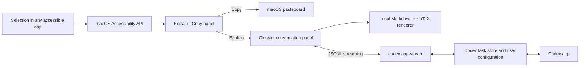

# Architecture

Glosslet is a native macOS accessory app built with AppKit and SwiftUI.



## Selection

`SelectionMonitor` observes global mouse-up and selection-related keyboard
events. `AccessibilitySelectionReader` asks the focused accessibility element
for `AXSelectedText`, its selected range, the full range bounds, and the
trailing insertion-point or final-character bounds. A mouse selection uses the
actual mouse-up location as the toolbar anchor. This keeps the toolbar beside
the selection endpoint even for long, multiline selections. Zero-sized or
invalid Accessibility geometry is rejected before screen-safe fallback
placement. `SelectionAnchorTracker` latches that resolved anchor for the
selection's text range; passive polling can detect a different selection but
cannot reposition the existing toolbar as the pointer moves or range geometry
arrives later. Secure text fields and Glosslet's own process are ignored.

One `AccessibilityPermissionMonitor` owns the live trust state used by
onboarding, Settings, the menu-bar status, and selection handling. It refreshes
on a short common-run-loop timer and immediately when Glosslet becomes active,
so returning from System Settings does not require a process restart. The
repair action runs `tccutil reset Accessibility com.winechord.glosslet`; it can
remove only Glosslet's stale entry and cannot grant access by itself.

The Accessibility coordinate system is converted per display before the panel
is positioned. Both panels are available across Spaces and full-screen apps.

## Conversation surface

The conversation shell is native AppKit and SwiftUI. Its transcript is a local
`WKWebView` with a non-persistent website data store and a restrictive Content
Security Policy. Bundled copies of markdown-it, highlight.js, and KaTeX render
Markdown, code, tables, and mathematics without a CDN or runtime network
dependency. Raw HTML is disabled.

Only the currently changing message is replaced during streaming. Existing
messages remain in the DOM, and automatic scrolling pauses when the reader
scrolls away from the bottom. Code-copy actions cross a narrow WebKit message
bridge to the macOS pasteboard. External links open only after a click. Remote
Markdown images are represented as links instead of being fetched
automatically.

The panel starts unpinned. A global outside-click monitor and app-activation
observer hide it when focus moves elsewhere, while the Codex turn continues in
the background. Pinning disables those dismissal observers and keeps the panel
above other apps until it is unpinned or closed.

Model and reasoning-effort controls live in the native header. They update the
same persisted model policy used by Settings, and each option comes from the
current Codex App Server model catalog. The controls are locked while a turn is
running so the visible configuration always matches the active request.

## Codex transport

`CodexAppServerClient` launches the Codex executable already installed for the
current user:

1. Codex standalone installation
2. `~/.local/bin/codex`
3. `PATH`
4. Codex desktop resources
5. Homebrew locations

`GLOSSLET_CODEX_PATH` can override discovery for development.

The client performs the app-server initialization handshake and exchanges
newline-delimited JSON-RPC messages over standard input and output. Responses,
notifications, streamed agent-message deltas, turn lifecycle events, and
approval requests are decoded into typed Swift values.

An active task remains attached to the live app-server process across
consecutive Glosslet turns. The transcript reports connection, history refresh,
reasoning, and response-writing stages separately and derives elapsed time from
the original request timestamp. Concurrent startup callers share one connection
task so onboarding, model discovery, and an immediate selection cannot race
multiple app-server processes. Launch preparation also restores the saved fixed
task and asks app-server to populate its cached skill, hook, and MCP metadata.
This moves deterministic environment discovery off the first visible request
without sending a model turn.

## Persistent task invariant

Every new task uses `thread/start` with `ephemeral: false`. Production Glosslet
never deletes or archives a user task; the opt-in integration harness archives
only the disposable tasks it creates. The default mode stores one task ID in
`UserDefaults` and resumes it for later explanations. Per-explanation mode
starts a separate persistent task each time.

Tasks use the same Codex home and authentication as the user's Codex app, so
the Codex app can discover and continue them. The reverse direction works too:
consecutive Glosslet requests reuse the already attached task, while activation
of the Codex app marks that task as externally changed. Glosslet restarts the
app-server and reloads the persistent task from disk before the next request
only in that case. This preserves cross-process history without imposing a cold
start on every explanation.

Codex remains responsible for context-window management, automatic compaction,
and rollover. Glosslet does not choose a token threshold, schedule a background
maintenance turn, or call `thread/compact/start`. It resumes the persistent task
and submits each explanation or follow-up directly through `turn/start`, while
native context-management events remain part of the Codex task lifecycle.

## Model policy

The app calls `model/list` instead of hard-coding a version. The default policy:

1. Ignore hidden and review-only entries.
2. Prefer the visible model marked as the current Codex default.
3. Select the lowest reasoning effort advertised by that model.
4. Select the `priority` service tier when that model advertises it.

Users may instead select Codex defaults, or select a specific visible model and
supported effort. The model picker identifies priority mode and notes that it
increases Codex usage.

## Storage

Glosslet stores only preferences and the fixed Codex task identifier in
`UserDefaults`. Codex owns conversation history. The stable working directory
is:

```text
~/Library/Application Support/Glosslet/Workspace
```
